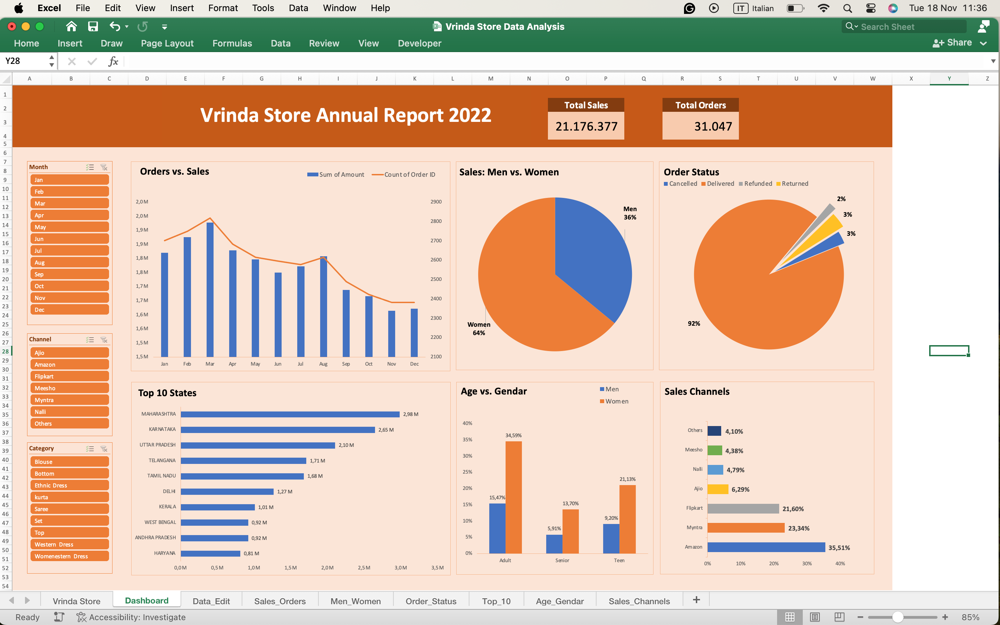

# Vrinda Store Data Analysis (Interactive Excel Dashboard)

## Project Objective
The Vrinda Store wants to create an annual sales report for 2022. This allows the store to understand its customers, grow more sales in 2023, and optimize marketing strategies based on data-driven insights.

## Questions (KPIs)
- Compare the sales and orders using a single chart.
- Which month got the highest sales and orders?
- Who purchased more - Men or Women?
- What are the different order statuses in 2022?
- List the top 10 states contributing to the sales.
- Relation between age and gender based on the number of orders.
- Which channel is contributing maximum to the sales?

## Process
- **Data Verification:** Verified data for any missing values and anomalies, and sorted out the same.
- **Data Transformation:** Ensured data is consistent and clean with respect to data type, data format, and values used. Created new columns for 'Month' and 'Age Group'.
- **Pivot Tables:** Created pivot tables according to the questions asked.
- **Dashboarding:** Merged all pivot tables into one dashboard and applied slicers to make the dashboard interactive and dynamic.

## Dashboard Interaction

*(View the full interactive dashboard in the Excel file attached)*

## Project Insights
- **Women are the Primary Revenue Driver:** Women contribute nearly **65%** of total sales, confirming they are the most valuable customer segment.
- **Top 3 States Drive Significant Volume:** Maharashtra, Karnataka, and Uttar Pradesh are the clear leaders in sales volume (~35%).
- **Adults (30-49) are the Core Demographic:** The "Adult" age group is the single largest contributor to sales (~50%).
- **Amazon, Flipkart, and Myntra Dominate:** These three channels account for the vast majority of revenue (~80%).

## Final Conclusion & Recommendations
To improve the sales of Vrinda Store, marketing strategies should be **heavily targeted towards women aged 30-49 years** living in **Maharashtra, Karnataka, and Uttar Pradesh**. 

Ads, offers, and coupons should be prioritized on **Amazon, Flipkart, and Myntra**, as these channels drive the highest return on investment. Additionally, while women are the core, specific micro-campaigns for men in the "Bottom" and "Ethnic Dress" categories could provide incremental revenue.
